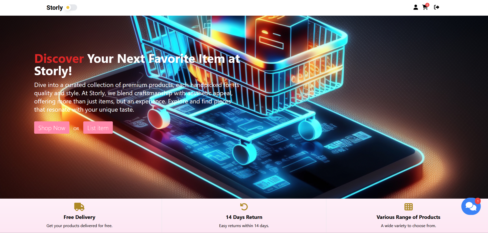

# Storly: Your One-Stop E-commerce Platform

Storly is a feature-rich e-commerce platform that brings a seamless shopping experience to both buyers and sellers. Explore a world of products at your fingertips, or set up your own store with ease.

[Explore Storly Live](https://storly.netlify.app/)



## Key Features

- **User Authentication**: Sign up, log in, and manage your account with ease.
- **Product Discovery**: Search and browse products, view detailed product information, and sort items based on common factors like price.
- **Advanced Filtering**: Narrow down your search with filters based on category, brand, and price range (min-max).
- **Wishlist Management**: Add and keep track of your favorite items in a specialized wishlist.
- **Seller Dashboard**: List your items, manage orders, and interact with buyers. Preview items in real-time as they are being added to the website, and apply discounts to entice buyers.
- **Rating and Reviews**: Share your experiences with products through ratings and reviews.
- **Shopping Cart and Checkout**: Add products to your cart and breeze through our streamlined checkout process.
- **Order Management**: View and manage your orders from your personalized user panel.
- **Password Management**: Change or reset your password effortlessly.
- **Piwik PRO Integration**: Monitor and analyze e-commerce activities with Piwik PRO tracking.
- **Simple Chat Bot**: Engage with our simple chat bot for basic interactions and support.
- **Theme Toggle**: Switch between light and dark mode for a comfortable browsing experience.
- **Personalized Recommendations**: Discover new items with a list of recommended products tailored to your browsing and purchasing history.

> 🚀 More features are on the horizon! Stay tuned for updates.

## Getting Started

### 1. Clone the Repository

```bash
git clone https://github.com/Mariusz-Lazarz/Storly.git
```

### 2. Install Dependencies

```bash
cd Storly
npm install
```

### 3. Start the Development Server

```
npm run start
```

### 4. Configure Piwik PRO (optional)

If you're not using Piwik PRO analytics, skip this step.
Update the Piwik PRO credentials in the index.js file located in the /src directory (line 12).

```
PiwikPro.initialize(
'xxxxxxxx-195d-4aae-b9ca-xxxxxxxxxxxx',
'https://instance.piwik.pro'
);
```

### 5. Dive In!

Now you're all set! Explore Storly's functionalities, and feel free to contribute to further enhancements!

Note: Please utilize the provided database and credentials respectfully as they are hosted on a free Google hosting plan. Excessive account registrations or data usage may affect its availability for other users. Thank you!

### License

MIT © Mariusz Łazarz
