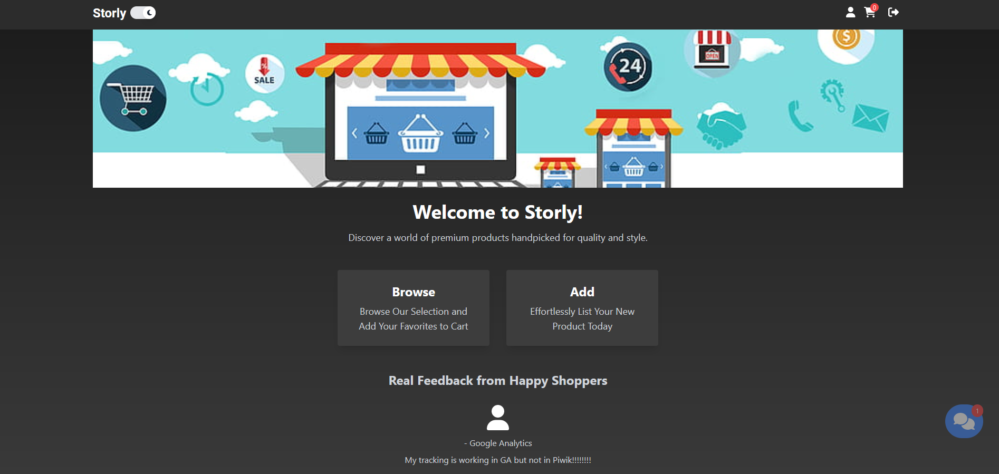

<h1>Storly operates as an e-commerce platform with an array of features:</h1>

  <h3>User account creation and login capabilities.</h3>

  <h3>Browsing a primary store page featuring offers and accessing detailed pages for each product.</h3>

  <h3>Listing users' own items.</h3>

  <h3>Adding products to a basket and placing orders.</h3>

  <h3>Viewing a user panel that contains a list of orders.</h3>

  <h3>Enabling the owner-user to edit and delete offers.</h3>

  <h3>Tracking Piwik PRO ecommerce capabilties.</h3>

  <h4 style='color:red'>Additional functionalities will be introduced in the future.</h4>

How to Use

1. Clone the Repository

First, clone the repository to your local machine. You can do this using the following command in your terminal:

bash

git clone https://github.com/Mariusz-Lazarz/Storly.git

2. Install Dependencies

Navigate to the project directory and install the required dependencies using npm:

bash

cd Storly

npm install

3. Start the Development Server

Once the dependencies are installed, start the development server:

bash

npm run start

This will start the development server and open the application in your default web browser at localhost:3000.

4. Update Piwik PRO Credentials

Navigate to the index.js file located in the /src directory of the project. Update the Piwik PRO credentials (website ID and instance URL) in line 12.

PiwikPro.initialize(
'xxxxxxxx-195d-4aae-b9ca-xxxxxxxxxxxx',
'https://instance.piwik.pro'
);

5. Explore the App

Now, the application should be configured and running with your Piwik PRO credentials. Explore the app functionalities!

Note

Please use the provided database and credentials respectfully. It's hosted on a free Google hosting plan, and excessive account registrations or data usage may impact its availability for other users. Thank you for your consideration!
Contributing

MIT © Mariusz Łazarz
